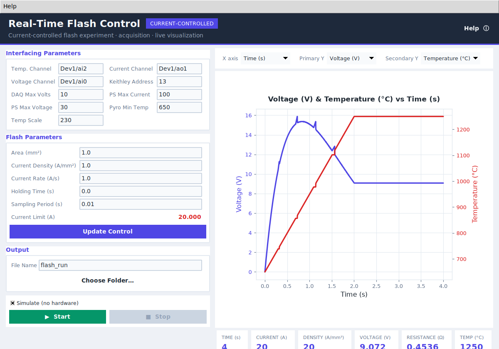

# Real-Time Flash Control

**Current-controlled flash (sintering) experiment control, data acquisition and live visualization.**

A desktop application for running flash experiments: it ramps a controlled
current through a sample at a set rate up to a target current limit, holds it,
and records voltage, resistance and temperature in real time — with a live
dual-axis plot and tab-separated `.csv` logging.



> The live plot above is a built-in **simulation** — no hardware required to try it.

---

## Highlights

- **Current-controlled ramp** with auto-computed current limit (`density × area`), validated against the power-supply rating.
- **Live, embedded plot** (matplotlib in the window) with selectable X / dual-Y channels.
- **Simulation mode** — a built-in flash model so you can launch, learn and test the app with **no DAQ or Keithley attached**.
- **Responsive UI** — acquisition runs on a worker thread; **Stop is always responsive** and leaves the hardware in a safe idle state.
- **Robust I/O** — cross-platform file paths, validated inputs, clean error dialogs.
- **Tested** — a pytest suite covers the configuration maths, the runner and the simulation.

## Install

Requires Python 3.9+.

```bash
# GUI + the built-in simulator (recommended to start)
pip install -e ".[gui,dev]"

# also driving real hardware (NI-DAQmx + GPIB/VISA)
pip install -e ".[gui,hardware]"
```

The core logic and simulation need **none** of the optional dependencies, so the
test suite runs anywhere.

## Quick start

```bash
python main.py                       # launch the GUI
python -m flashcontrol               # equivalent
python -m flashcontrol --simulate-headless   # quick no-GUI smoke test
```

Leave **“Simulate (no hardware)”** ticked to run a realistic simulated
experiment. Then set the **Flash Parameters**, press **Update Control** to
compute the current limit, choose an output folder, and press **Start**.

See **Help → Setup & Hardware Guide** in the app (or the header **Help** link)
for setup, the equipment list, and how to cite.

## Checking hardware readiness

The header shows live **connection indicators** for the **NI-DAQ** and the
**Keithley**. Click **⟳ Check** to probe them:

- It lists the connected NI-DAQ devices and confirms the configured device exists.
- It opens the GPIB/VISA session and queries the Keithley `*IDN?` identity.
- Each dot turns **green** (connected) or **red** (not found / error), and the
  status bar shows the full detail (device list, instrument identity, or the error).

In **Simulate** mode both report ready immediately. When running on real hardware,
if you press **Start** without a successful check, the app asks you to confirm.

## Testing

```bash
pip install -e ".[dev]"     # pytest + numpy; no GUI/hardware needed
pytest -q                   # run the unit test suite (config, runner, simulation, writer)

python -m flashcontrol --simulate-headless   # end-to-end simulated run, no GUI
```

The suite runs anywhere because the core logic and simulation import no
Tk/matplotlib/driver code. CI runs it on Python 3.9 / 3.11 / 3.12.

## Hardware & equipment

The experiment is current-controlled: the DAQ commands the supply current via an
analog-output voltage, while voltage and temperature are measured back.

| Role | Instrument | Default |
|------|------------|---------|
| Current command | NI-DAQ analog **output** | `Dev1/ao1` |
| Supply voltage sense | NI-DAQ analog **input** | `Dev1/ai0` |
| Sample temperature | Pyrometer → NI-DAQ analog **input** | `Dev1/ai2` |
| Precise sample voltage | Keithley DMM over GPIB | `GPIB0::13` |
| Current source | Programmable DC power supply | — |

Scaling (set under *Interfacing Parameters*):

- `current_scale = PS Max Current / DAQ Max Volts`
- `voltage_scale = PS Max Voltage / DAQ Max Volts`
- `Temperature (°C) = raw × Temp Scale + Pyro Min Temp`

Drivers: **NI-DAQmx** (`nidaqmx`), **NI-VISA** (`pyvisa`), plus `matplotlib`.

## Project structure

```
flashcontrol/
  config.py            # HardwareConfig / ExperimentConfig dataclasses + validation
  hardware/
    base.py            # Instruments interface (ABC)
    nidaq.py           # real NI-DAQ + Keithley backend
    simulated.py       # driver-free flash simulation
  core/
    sample.py          # Sample data model
    runner.py          # threaded acquisition loop (clock/sleep injectable)
    writer.py          # tab-separated CSV writer
  gui/
    app.py             # Tkinter window
    plot.py            # embedded live matplotlib plot
    theme.py           # modern theme / styling
    help.py            # in-app setup, hardware & citation help
main.py                # launcher (replaces the original single-file script)
tests/                 # pytest suite (no GUI/hardware needed)
```

The layers are deliberately decoupled: `config`, `hardware` and `core` import no
Tk/matplotlib/driver code, so the experiment logic is unit-tested against the
simulation.

## Development & testing

```bash
pip install -e ".[dev]"
pytest -q
```

CI runs the suite and the headless simulation on Python 3.9 / 3.11 / 3.12
(see `.github/workflows/ci.yml`).

See `CONTRIBUTING.md` for the architecture and extension points, and
`CHANGELOG.md` for the version history.

> **Documentation note:** the bundled `RealTimeFlashControl_Documentation.pdf`
> describes the original **v1.0** single-file program and its API
> (`AppRunModule`, `PlotManager`, etc.), which no longer exist in v2.0. For the
> current version, use this README and the in-app **Help**. The PDF is retained
> for historical reference only.

---

## Citation

If you publish work that used this software, please cite it:

> _Bamidele, Emmanuel (2023). Real-Time Flash Experiment Control and Visualization software. figshare. Software._ https://doi.org/10.6084/m9.figshare.24054759.v1

Repository: https://github.com/Emmanuel-Bamidele/Real-Time-Flash-Control

A citation is appreciated — it helps the author track where the tool is used and
prioritise enhancements.

## Copyright

© 2023 Emmanuel Bamidele. All rights reserved.

Real-Time Flash Experiment Control and Visualization software, including all
related files, data, and documentation, are the intellectual property of
Emmanuel Bamidele. The primary use of this software is for research and
educational purposes. Any use for commercial purpose must be discussed with the
author. Any publication using this software must properly cite it.

For questions, inquiries and recommendations, please contact:

- Emmanuel Bamidele
- Email: correspondence.bamidele@gmail.com
- Website: https://www.emmanuelbamidele.com

## License

Released under the Apache License, Version 2.0. A copy of the license is in the
`LICENSE` file, or at https://www.apache.org/licenses/LICENSE-2.0

## Disclaimer

The software is provided “as is” without warranty of any kind, express or
implied, including but not limited to the warranties of merchantability, fitness
for a particular purpose, and non-infringement. In no event shall the authors or
copyright holders be liable for any claim, damages, or other liability, whether
in an action of contract, tort, or otherwise, arising from, out of, or in
connection with the software or the use or other dealings in the software.

The software is intended for research and educational purposes only. It is the
responsibility of the user to ensure proper operation and adherence to all
applicable laws and regulations while using this software.
